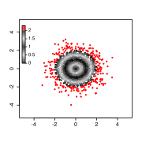
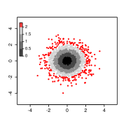

Barbouille
================================================================================

Barbouille is an R package with coloring, labeling, highlighting and plotting
functions.

### Installation ###

#### Prerequisites ####

Before installing and using Barbouille, install the following dependencies:

  - R environment version 3.2 or higher
  - R packages: stringr, colorspace
  
#### Installing Barbouille ####

```R
library("devtools")
install_github("benja0x40/Barbouille")
```

### Features ###

#### Coloring ####




```R
# Generate samples from two normally distributed random variables
x <- rnorm(2000)
y <- rnorm(2000)
z <- sqrt(x^2 + y^2)
```

```R
clr.prm <- defineColors(seq(0, 2, 0.5), c("black", "lightgrey"), above = "red", range = c(0, 2.3))
```

```R
clr <- makeColors(z, parameters = clr.prm)
plot(x, y, xlim = c(-5, 5), ylim = c(-5, 5), pch = 20, col = clr)
colorLegend("topleft", parameters = clr.prm, cex = 0.8)
```

```R
clr.prm <- defineColors(
  thresholds = c(0, 2), colors = c("black", "lightgrey"), above = "red", range = c(0, 2.3), levels = 4
)
```

```R
clr <- makeColors(z, parameters = clr.prm)
plot(x, y, xlim = c(-5, 5), ylim = c(-5, 5), pch = 20, col = clr)
colorLegend("topleft", parameters = clr.prm, ticks = seq(0, 2, length.out = 5), cex = 0.8)
```

#### Highlighting ####

#### Labelling ####

#### Venn diagrams (experimental) ####

