Barbouille
================================================================================

My collection of plotting and color mapping functions, home cooked with the base
R graphics library.

### Main features

* Empirical distributions: `BivariateDensity` and `SideBySideDensity` functions
* Piecewise color mapping: `DefineColorMap`, `MakeColors`, `ColorLegend` functions

Basic documentation of each function is available in the `Barbouille` package
reference manual.  
See also the [code examples and images](#examples)
and the [installation instructions](#install)
in the following sections.

### <a name="examples"></a>Examples

```r
# Load package
library(Barbouille)
```

#### Empirical distributions

```r
# Create a color mapping function
cmf <- function(k) colorize(k, mode = "01", col = "ry")
```

With any matrix representing observations of numeric variables,
the `SideBySideDensity` function can be useful to visualize the empirical
distributions of these variables.
In the following examples, `x` is a matrix of
50000 observations (rows) x 5 variables (columns named `A`, `B`, `C`, `D`, `E`)
which was randomly generated using mixtures of normal distributions.

```r
# Examples using the default color mapping function
h <- SideBySideDensity(x, nx = 200)
h <- SideBySideDensity(x, nx = 200, smoothx = 25)
h <- SideBySideDensity(x, nx = 200, method = "ash")
```

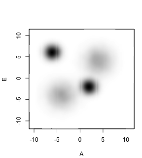
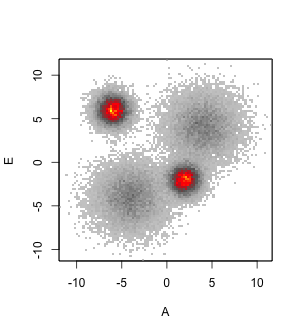
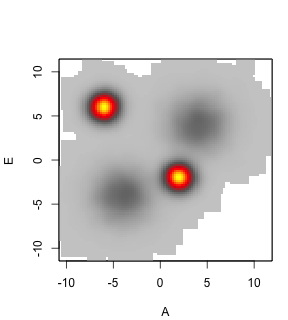

```r
# Examples using a custom color mapping function (cmf)
h <- SideBySideDensity(x, nx = 200, mapper = cmf, smoothx = 5)
h <- SideBySideDensity(x, nx = 200, jitter = "norm", mapper = cmf)
h <- SideBySideDensity(x, nx = 200, jitter = "norm", mapper = cmf, method = "ash")
```

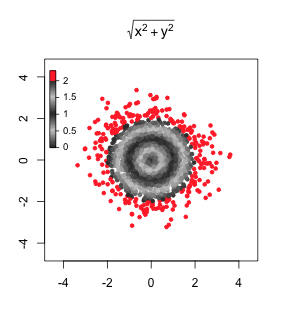
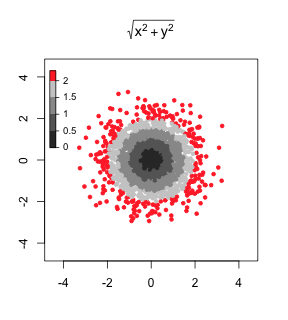
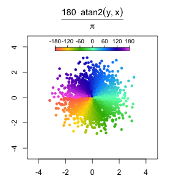

```r
h <- BivariateDensity(x[, c(1, 5)], method = "ash")
h <- BivariateDensity(x[, c(1, 5)], mapper = cmf)
h <- BivariateDensity(x[, c(1, 5)], method = "ash", mapper = cmf)
```

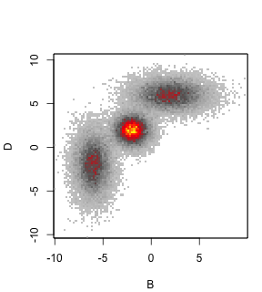
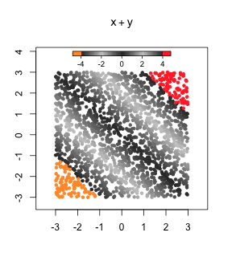
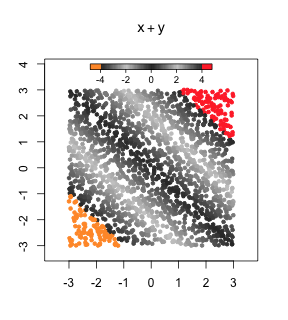

#### Piecewise color mapping

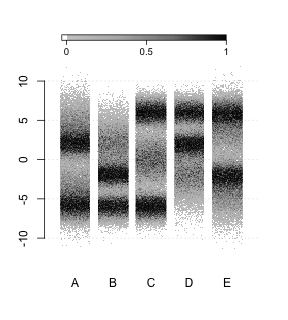

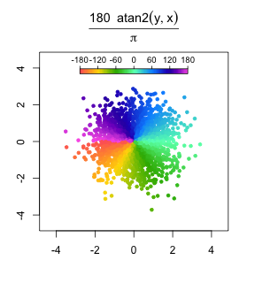
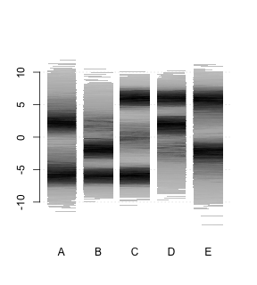
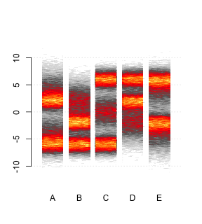
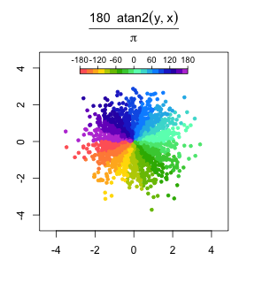

### <a name="install"></a>Installation

Run the `R` code below to install `Barbouille`.

```R
library("devtools")
install_github("benja0x40/Barbouille")
```

If the installation fails, try to install dependencies as indicated below.

#### Dependencies
  - [R environment](https://www.r-project.org/) version 3.4 or newer
  - To develop and execute `R` scripts we recommend using [RStudio](https://www.rstudio.com/products/rstudio/download)
  - CRAN packages `devtools`, `colorspace`, `ash`, `triangle`, `caTools`

After installing the R environment (and RStudio), run the `R` code below
to install all dependencies for `Barbouille`.

```R
# Setting value below to TRUE will reinstall all required packages (optional)
reinstall <- FALSE

# Detect already installed packages
pkg <- ifelse(reinstall, c(), installed.packages()[, "Package"])

# CRAN packages
lst <- c("devtools", "colorspace", "ash", "triangle", "caTools")
lst <- setdiff(lst, pkg)
if(length(lst) > 0) install.packages(lst, dependencies = T)

# GitHub packages
library("devtools")
install_github("benja0x40/Barbouille")
```
