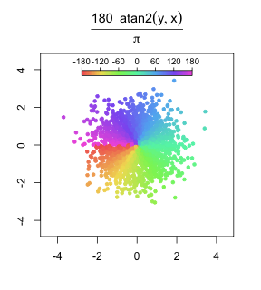
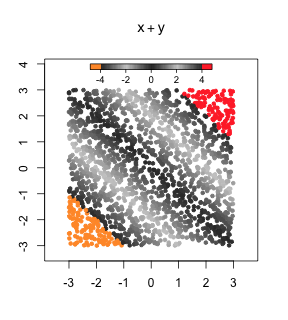
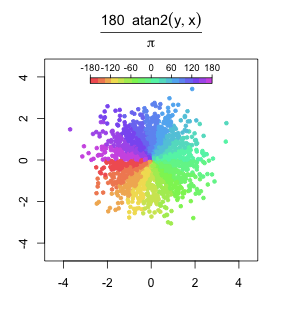
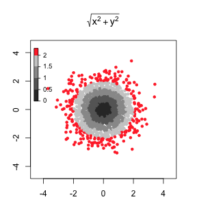

Barbouille
================================================================================

Barbouille is an R package for precise color mapping on scatterplots.

### Package installation ###

#### Prerequisites ####

  - [R environment](https://www.r-project.org/) version 3.x
  - CRAN packages `stringr`, `colorspace`, `ash`

Run the R code below to install CRAN packages dependencies for Barbouille.

```R
# Already installed
pkg <- installed.packages()[, "Package"]

# CRAN packages
lst <- c("stringr", "colorspace", "ash")
lst <- setdiff(lst, pkg)
if(length(lst) > 0) install.packages(lst, repos = "https://cloud.r-project.org/")
```

#### Installation from github ####

Run the bash code below to build package Barbouille from github.

```bash
# Clone github repository
cd ~/DataImportTools
git clone git@github.com:benja0x40/Barbouille.git

# Update cloned repository
cd ~/DataImportTools/Barbouille
git pull

# Build package
cd ..
R CMD build Barbouille
```
Run the R code below to install Barbouille.

```r
# When package will be public
# library("devtools")
# install_github("benja0x40/Barbouille")

# Using manually built package archive
install.packages("Barbouille_0.3.0.tar.gz")
```

### Main features ###

#### Gallery ####








